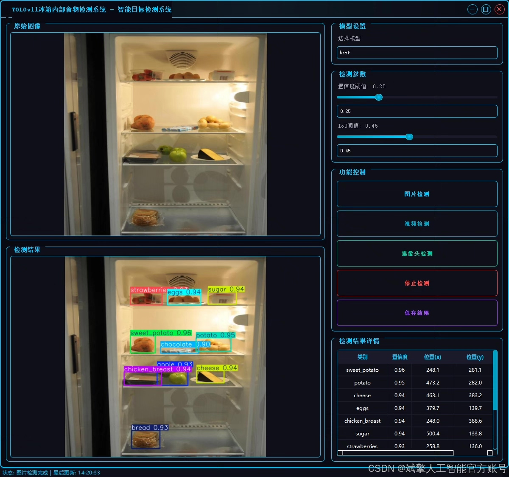
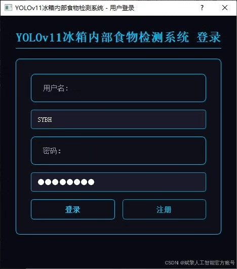
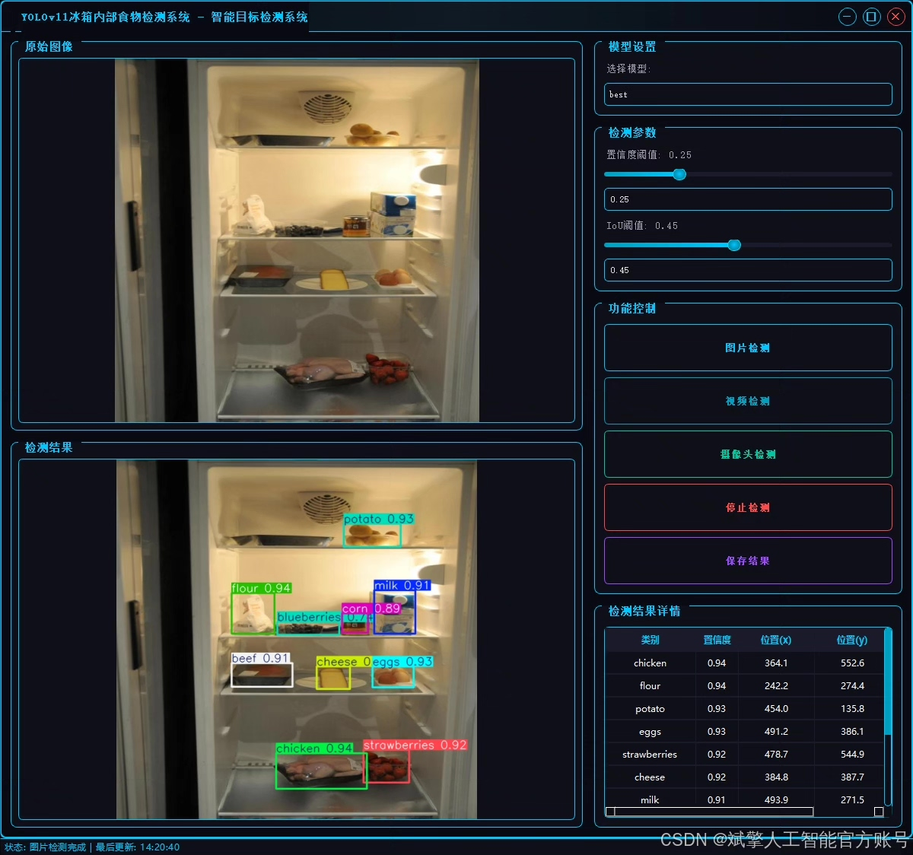
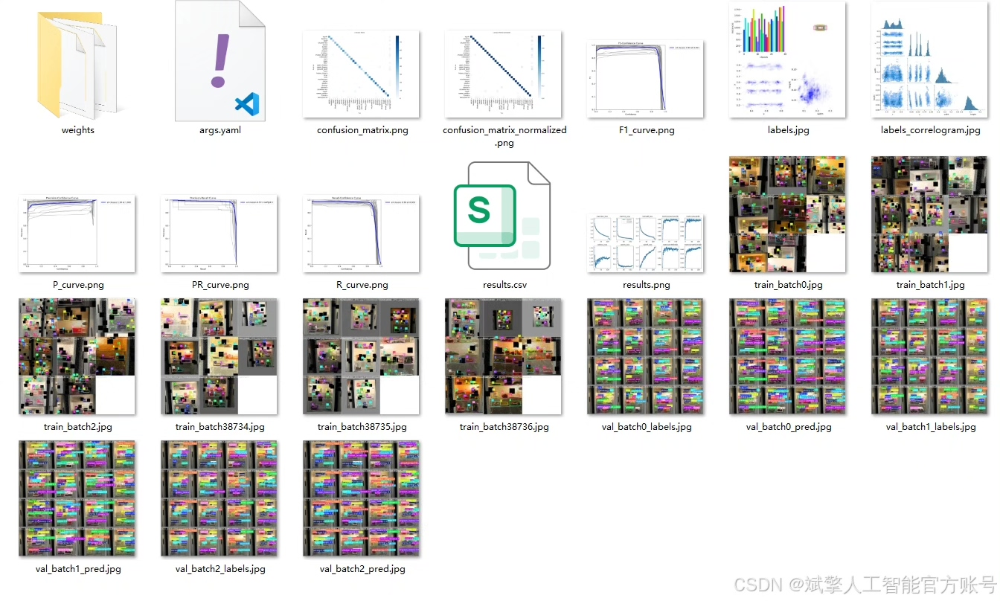
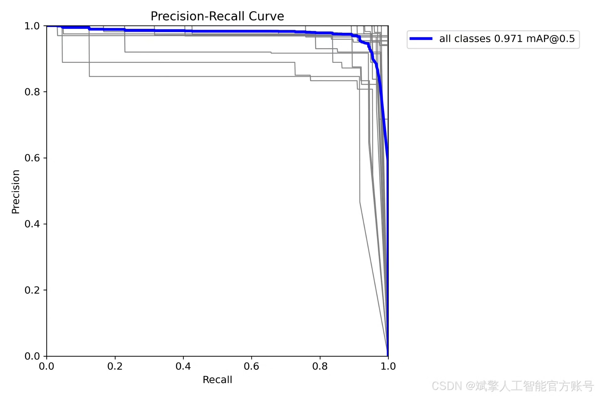
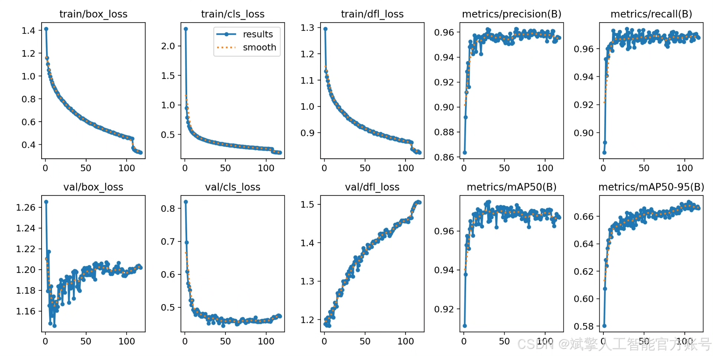
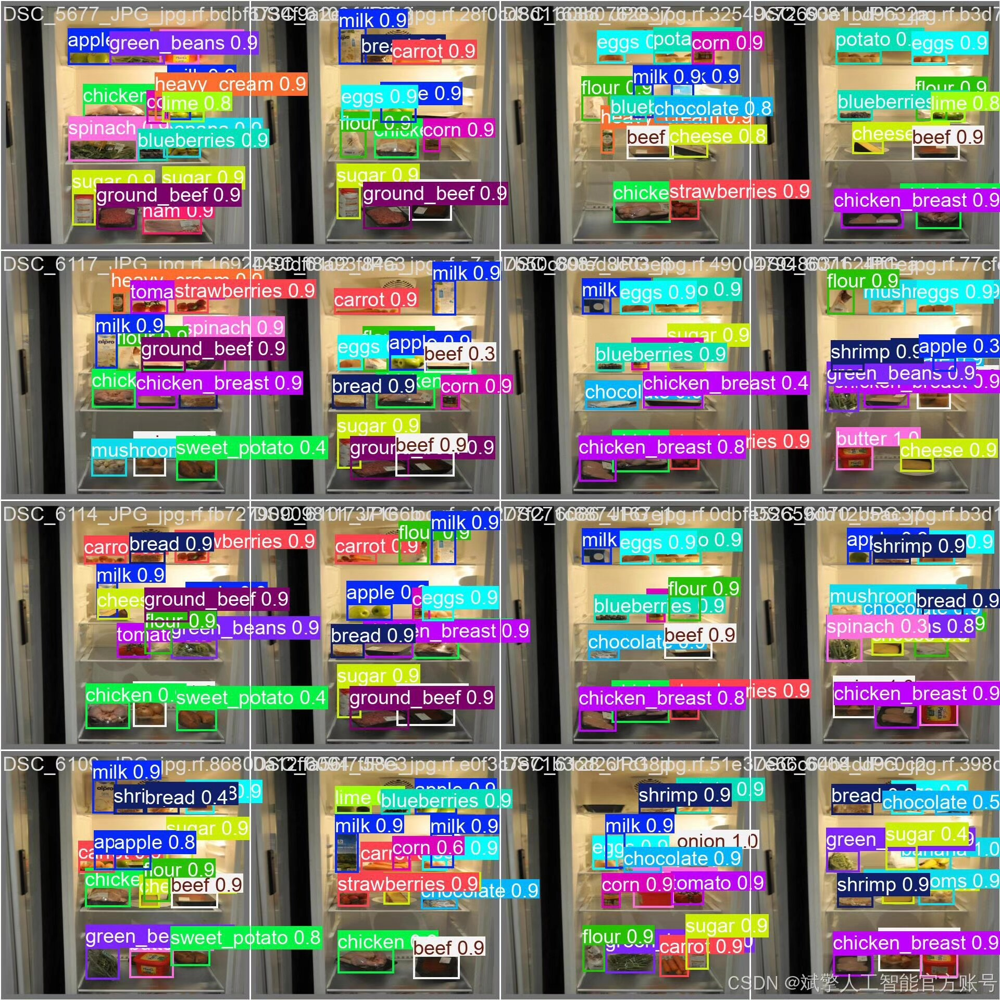
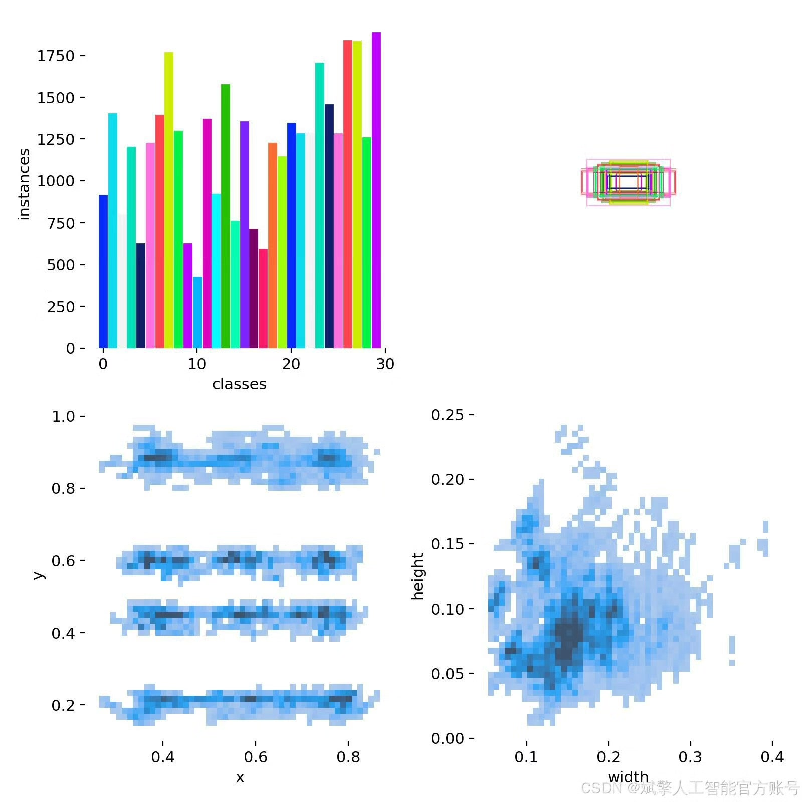
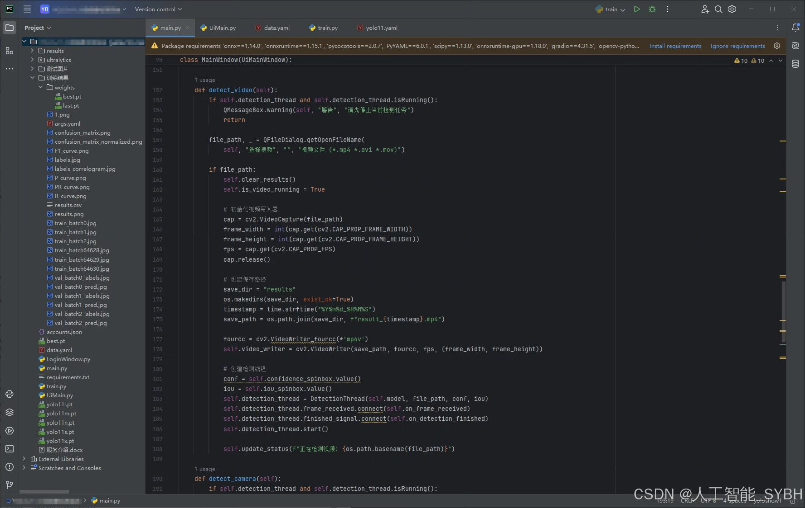

# YOLOv11 Refrigerator Food Detection System

## Body

YOLOv11 Food Detection System for Refrigerators Based on Deep Learning YOLOv11: A refrigerator food detection system (YOLOv11+YOLO dataset + UI interface + login and registration interface + Python project source code + model)

nc: 30 classes,
Name: ['apple', 'banana', 'beef', 'blueberries', 'bread', 'butter', 'carrot', 'cheese', 'chicken', 'chicken breast', 'chocolate', 'corn', 'eggs', 'flour', 'goat cheese', 'green beans', 'ground beef', 'ham', 'heavy cream', 'lime', 'milk', 'mushrooms', 'onion', 'potato', 'shrimp', 'spinach', 'strawberries', 'sugar', 'sweet potato', 'tomato'],
Dataset size: Training set 2896 images, validation set 103 images, test set 51 images.

✅ User Login and Registration: Support password detection and security verification.

✅ Three detection modes: Based on the YOLOv11 model, support image, video, and real-time camera three detection, accurately recognize targets.

✅ Dual-screen comparison: Display original images and detection results on the same screen.

✅ Data visualization: Real-time table displaying the category, confidence, and coordinates of detected targets.

✅ Intelligent parameter adjustment: Offer a confidence slide bar to dynamically optimize detection accuracy, adapting to different scene requirements.

✅ Sci-fi style interactive interface: Dark theme combined with dynamic light effects, reducing visual fatigue and improving operational experience.

## Images

## Payment

Here is a pay link on Stripe ( https://buy.stripe.com/3cs8yP7sY87d0vu9AB ). Please contact me lonlonago@foxmail.com after funding $89, and I will send you a complete data files , thank you!

